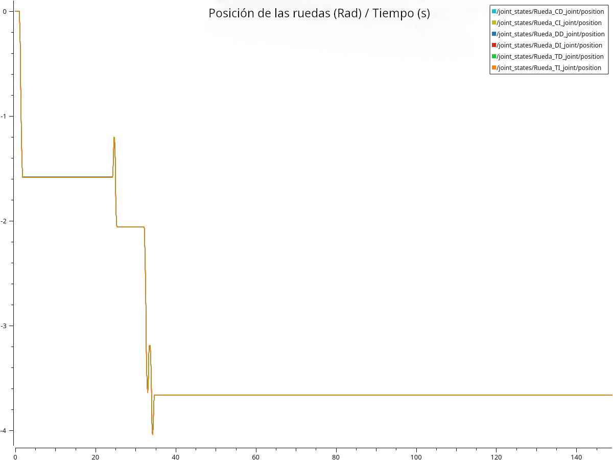
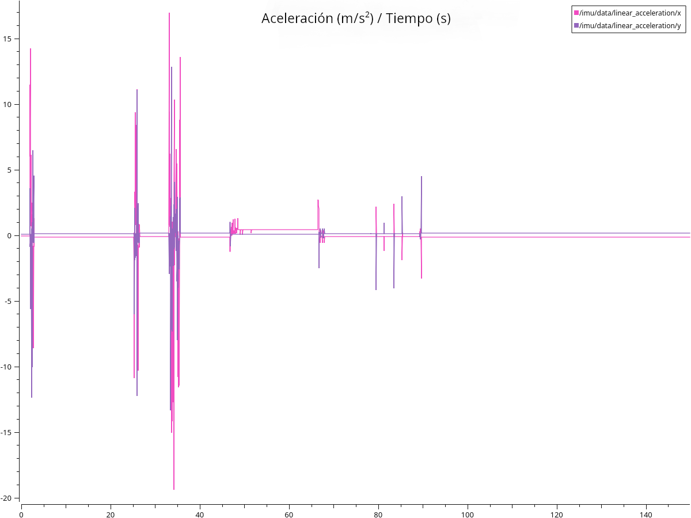
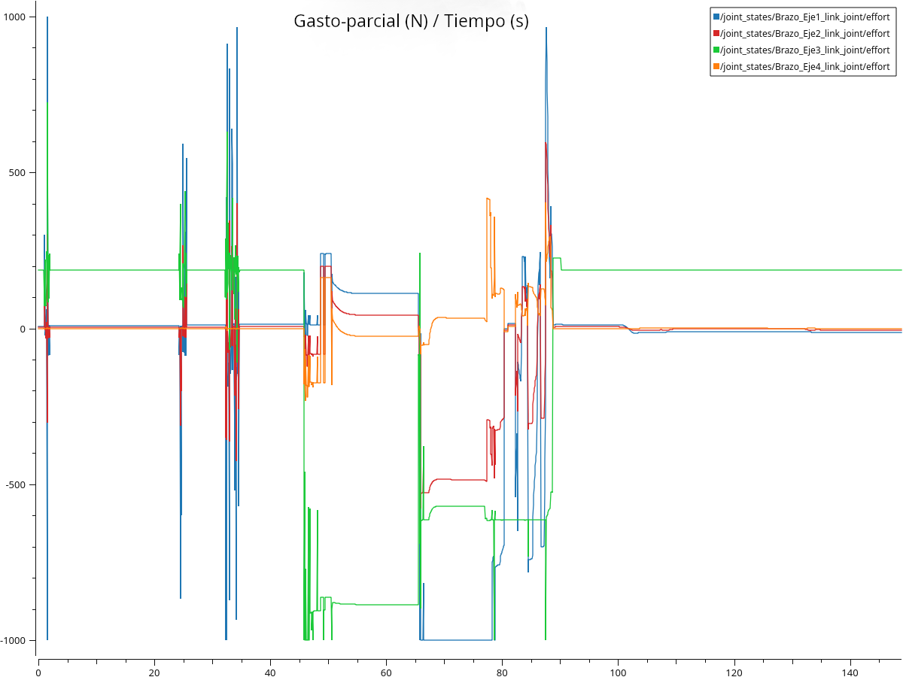

# Modelado_practica_3

## Gráfica con la posición de las ruedas

En la gráfica estamos observando el desplazamiento en función del tiempo, que realizan las ruedas sobre el escenario de Gazebo.

El Eje Y representa la posición de las ruedas en cada momento de la teleoperación, mientras que el eje x represeta el tiempo transcurrido.

A continuación explicaré a que se deben cada pico de la gráfica:
1) En el primer instante entre t=0 y t=5 se produce un movimiento con valor negativo, esto de debe aque el avance del rover se realiza sobre el eje x del mundo en gacebo ynosotros estamos yendo en sentido contrario al positivo (de la "base"). El movimiento es producido por una pequeña aproximación al objetivo, para medir si la pinza se encontraba en posición.
2) Entre t=5 y T=25 se produce una parada esperando que el brazo tome la posición de sostener pieza (posición en la que la pinza esta arriba).
3) Despues entre T=25 y T=35 se retoma la aproximación del rover a la pieza y se detiene el rover hasta el final de las maniobras. Se puede apreciar como la aproximación a sido escalonada, ya que el rover se movía rapido aun teniendo la velocidad baja y era necesario ir poco a poco.

Hay que destacar, que el movimiento realizado por todas las ruedas es el mismo en todo momento, ya que no he necesitado reorientar el rover para aproximarme al cubo. Si hubiera rotado, en la gráfica se verían picos en sentidos opuestos entre los pares de ruedas Derecha e Izquierda, siendo el grupo que ese encuentre mas cercano al eje de giro el que produce el "espejo" al par de ruedas opuesto.
Como veremos mas adelante, el rover siempre presenta un movimeinto oscilatorio duramte la marcha debido a los resalto en el terreno, pero serían mas bruscos de haber un movimiento consciente.

## Gráfica de la aceleración

En la siguiente gráfica veremos como el rover experimenta momentos de aceleración equivalentes al instante de aporximación al cubo.

El eje Y representa la aceleración lineal del rover y el eje x representa el tiempo trascurrido en la simulación.

Las aceleraciones son oscilantes debido a que, en los instantes de aproximanción, he teleoperado el coche con ligeros "toques" para conseguir una aproximación mas precisa.

1) En el primer instante entre t=0 y t=5 se produce la primera aproximación al cubo, como hemos visto en la anterior gráfica. Como en este momento el rover se encuentra en movimiento lineal hacia el objeto, se produce una aceleracion en sentido X mayor a la de Y.
2) Entre t=5 y t=25 se porduce el primer paro en el movimiento para elevar el brazo a la posición de sostener pieza.
3) Entre t=25 y t=35 vemos como se retoma la teleoperación y, comparando con la anterior gráfica, nos damos cuenta de que los picos se deben al movimiento escalonado en la aproximación.

Las oscilaciones en la aceleración son dadas por mi teleoperación a trompicones y por el desplazamiento por un suelo con textura. Este es el motivo por el cual el eje y posee aceleración a pesar de que el rover solo avanzara en linea recta. Los resaltos hacian que la aceleración registrada tuviera picos y que el coche oscilara ligeramente sobre el eje y produciendo el registro de una pequeña aceleración.

## Gráfica con las G-parciales de los ejes del brazo.

La siguiente gráfica muestra el gasto-parcial de cada articulación que compone el brazo.

Sobre el Eje Y se encuentra las fuerzas ejercidad por cada uno de los ejes del brazo y sobre el eje x, el tiempo transcurrido.

Los picos que aparecen en la gráfica, corresponden a las correcciones que produce el propio controlador para mantenerla posición del brazo cuando el coche tiembla debido a los resaltos del suelo.

1) En el primer instante entre t=0 y t=5 se produce un pico que coincide con la primera aproximación y la subida del Eje3 a la posición de sostener pieza.
2) Entre t=20 y t=45 se produce la segunda aproximación al cubo, mientras el Eje3 continua elevado  para no chocar con la caja. (los pico son causados por los temblores en la teloperación y por los resaltos en el terreno)
3) Entre t=45 y t=50 se produce la bajada del eje3 y el cierre de la pinza para coger el cubo. Podemos ver como la fuerza es negativa porque el desplazamiento de ese joint es negativo desde el estado de reposo al suelo.
4) Entre t=50 y t=65 se realiza la subida del eje3 con el objeto ya agarrado. Durante esta trayectoria, al sostener un cubo con peso, se generan oscilaciones en los demas ejes, que son compensadas por el controlador para mantener la posición "meta".
6) Entre t=65 y t=80 el brazo se movera con el cubo a la parte trasera del rover, de aquí que en la grafica se produzca fuerza negativa en el join para mover el eje1 sobre su eje de rotación. El movimiento al "lobby" se realiza en sentido de giro horario al eje z sobre el eje1 del brazo.
7) Entre t=80 y t=85 se deposita el cubo en el Deposito del rover y el brazo vuelve a colocarse en la posición de reposo "sostener objeto".

## Rosbag

El rosbag se encuentra comprimido en formato zip en este mismo repositorio.

